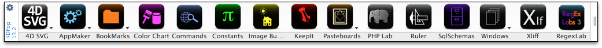
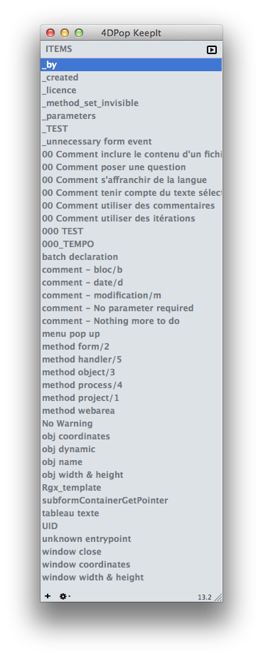
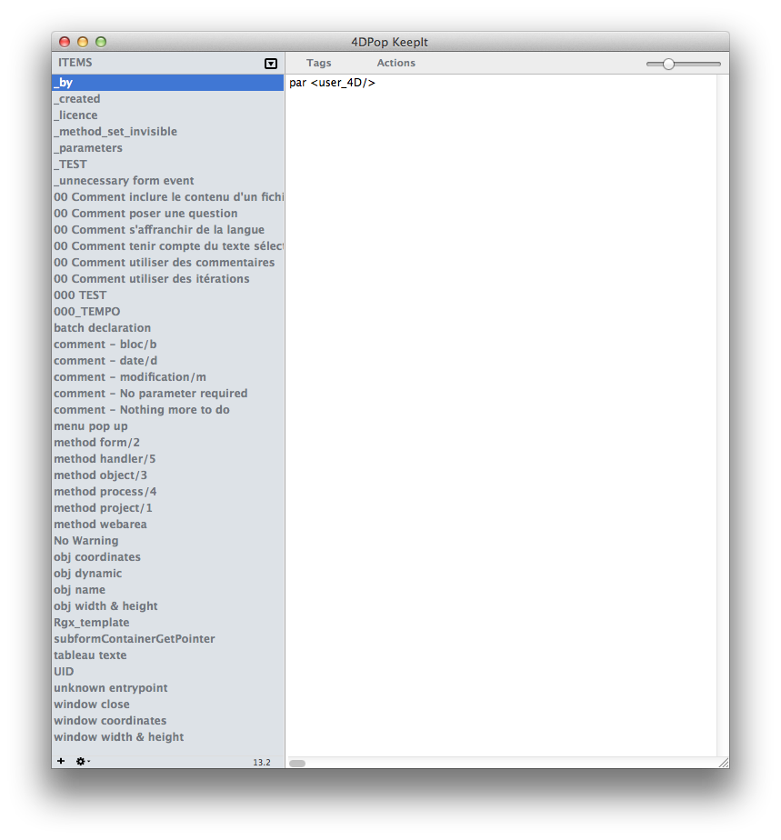

# 4DPop KeepIt

<!-- MARKDOWN LINKS & IMAGES -->
[release-shield]: https://img.shields.io/github/v/release/vdelachaux/4DPop-KeepIt.svg?include_prereleases
[release-url]: https://github.com/vdelachaux/4DPop-KeepIt.svg/releases/latest

[license-shield]: https://img.shields.io/github/license/vdelachaux/4DPop-KeepIt.svg

<!--BADGES-->


<br>
[![release][release-shield]][release-url]
[![license][license-shield]](LICENSE)
<br>


4DPop KeepIt is a snippets manager, these little bits of code or text that you reuse everywhere.

This tool allows you to store pieces of code and reuse them when needed through:
- a keyboard shortcut
- drag and drop
- copy and paste

Stored items are persisted across sessions and remain accessible from all databases once the component is loaded.

4DPop KeepIt is similar to 4D macros, but easier to use and more powerful.

* [🇫🇷 Regardez une démonstration](https://vimeo.com/17368785)
* [🇬🇧 View a demonstration](https://vimeo.com/17368771)

---

# Component installation

#### Make sure the `4DPop` component is installed.

## 

This component is compatible with the [Project Dependencies](https://developer.4d.com/docs/Project/components#monitoring-project-dependencies) feature. You can easily integrate it into your project by selecting “Design” > “Project Dependencies,” then choosing the GitHub tab and adding “vdelachaux/4DPop-KeepIt” as the repository address in the dialog box provided for this purpose. **This will allow you to receive updates over time.**

>📍No more notarisation problems with this installation method!



If the component 4DPop is not installed, create a method that calls:

```4d
KeepIt_tool
```
---

# Memorize a fragment

1. Select a snippet of code in the editor.
2. Drag it onto the 4DPop toolbar.
3. Drop it on the **KeepIt** button.
4. Enter a name for the new item.

Done.

---

# Use a fragment

In the editor, type:

```text
$$ + Tab
```

A popup menu appears.

Select the desired item and its content is pasted into the editor.

---

# Tags

Snippets can contain tags evaluated at insertion time.

They use the same syntax as 4D macro tags.

In addition to native 4D macro tags, KeepIt adds the following.

---

## `<uid/>`

Replaced by a generated UID.

---

## `<database_name/>`

Replaced by the structure file name.

---

## `<keepit/>`

Includes another KeepIt item.

### Attribute

- `name`: item name to include

Example:

```xml
<keepit name="common_declaration"/>
```

---

## `<ask/>`

Creates an interactive macro.

### Attributes

- `message`: displayed prompt text
- `type`: expected answer type

Example:

```4d
ARRAY TEXT(<ask message="Name of the array?"/>;<ask message="Size of the array?"/>)
For($i;1;Size of array(<ask message="\1"/>);1)
    <ask message="\1"/>{$i}:="<ask message="Default value?"/>"
End for
```

Supported `type` values:

- `text`
- `integer`
- `real`
- `table`
- `field`
- `user`
- `group`
- `{value1;value2}`
- `{label1:value1;label2:value2}`

---

## `<file/>`

Replaced by the content of a text file.

### Attribute

- `url`

Supported forms:
- absolute path: `file://...`
- relative to database `Resources`: `#...`
- relative to KeepIt `Resources`: `/...`

---

## `<iteration/>`

Repeats a line multiple times.

### Attribute

- `count`

Example:

```4d
<iteration count="10"/>C_TEXT(vTEXT_<iteration/>)
```

---

## `<method-attribute/>`

Sets a project method attribute.

### Attributes

- `type`
- `value`

Example:

```xml
<method-attribute type="1" value="true"/>
```

---

## `<method_type/>`

Replaced by the type of the currently edited method.

---

# Conditional tags

```text
#_IF
#_ELSE
#_ENDIF
```

Example:

```4d
#_IF <ask message="Are you a woman ?" type="{Yes:1;No:0}"/>=1
// OK, you are a woman!
#_ELSE
// You are probably a man
#_ENDIF
```

---

# Managing snippets

Click the **KeepIt** toolbar button to open the editor.

|    |     |
| ---- | ----- |
||


Features:
- drag item into method editor
- copy interpreted content to clipboard
- rename by double-click
- edit text in right pane
- context menu actions
- export/import snippets
- drag export to desktop
- drop text files to import

Comments are supported:

```text
/* ... */
```

The first comment becomes the tooltip.

---

# 4D macros integration

KeepIt installs 3 macros when loaded.

| Name | Shortcut | Text entry | Description |
|---|---|---|---|
| KeepIt | Cmd + € | `$$` | Displays selection menu |
| KeepIt = | Cmd + = | `++` | Calls last snippet |
| KeepIt + | Cmd + ± | — | Creates fragment from selection |

---

# Shared method

A shared method is available:

```4d
Keepit_get_item_by_name
```

It can be used inside 4D macros.

Example:

```xml
<method>Keepit_get_item_by_name("database_name")</method>
```

---

# Source code

The component is distributed compiled.

Source code is available in the `Sources` folder inside the component folder.

---

# Forum

Dedicated forum:

- 4DPop Forum

---

# Appendix — Tokenization tags

Useful for 4DFR / 4DINTL compatible macros.

## `<command/>`

Localized 4D command name.

### Attribute

- `number`

Example:

```xml
<command number="34"/>
```

---

## `<constant/>`

Localized 4D constant.

### Attribute

- `id`

Example:

```xml
<constant id="2.2"/>
```

---

## Control flow localization tags

```xml
<if/>
<else/>
<end_if/>
<case_of/>
<end_case/>
<while/>
<end_while/>
<for/>
<end_for/>
<repeat/>
<until/>
```

These tags are replaced by localized control structures.

This allows the same snippet to work in:
- 4D INTL
- 4D FR

---

# References

- http://doc.4d.com/4Dv13/help/Title/en/page1034.html
- http://forums.4d.fr/Forum/FR/1467485/0/0

